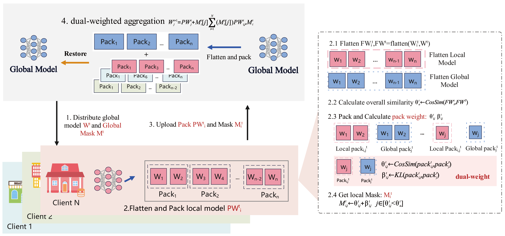

## FedCSPACK@AAAI-26

Tackling Resource-Constrained and Data-Heterogeneity in Federated Learning with Double-Weight Sparse Pack, accepted by AAAI 2026

[Arxiv Version](https://arxiv.org/abs/2601.01840)

## Abstract
Federated learning has drawn widespread interest from researchers, yet the data heterogeneity across edge clients remains a key challenge, often degrading model performance. Existing methods enhance model compatibility with data heterogeneity by splitting models and knowledge distillation. However, they neglect the insufficient communication bandwidth and computing power on the client, failing to strike an effective balance between addressing data heterogeneity and accommodating limited client resources. To tackle this limitation, we propose a personalized federated learning method based on cosine sparsification parameter packing and dual-weighted aggregation (FedCSPACK), which effectively leverages the limited client resources and reduces the impact of data heterogeneity on model performance. In FedCSPACK, the client packages model parameters and selects the most contributing parameter packages for sharing based on cosine similarity, effectively reducing bandwidth requirements. The client then generates a mask matrix anchored to the shared parameter package to improve the alignment and aggregation efficiency of sparse updates on the server. Furthermore, directional and distribution distance weights are embedded in the mask to implement a weighted-guided aggregation mechanism, enhancing the robustness and generalization performance of the global model. Extensive experiments across four datasets using ten state-of-the-art methods demonstrate that FedCSPACK effectively improves communication and computational efficiency while maintaining high model accuracy.


## FedCSPACK Design

The client shows the detailed process of the generation and selection of the local parameters package and mask. The server side displays the details of the dual-weighted aggregation.  

## Start
- Clone project
    1. git clone https://github.com/NigeloYang/FedCSPACK.git
    2. cd FedCSPACK
    3. mkdir models/results
    4. conda activate env_name (yourself)
- Generate dataset
    1. cd dataset
    2. sh data_gene.sh / python generate_[dataset_name]
- Test experiments
    1. cd ..
    2. sh test.sh


## Citation
```bibtex
@inproceedings{Yang26fedcspack,
  title={Tackling Resource-Constrained and Data-Heterogeneity in Federated Learning with Double-Weight Sparse Pack},
  author={Qiantao Yang and Liquan Chen and Mingfu Xue and Songze Li},
  booktitle={The 40th Annual AAAI Conference on Artificial Intelligence},
  year={2026},
}
```

## Acknowledgments
Our code is [PFLlib](https://github.com/TsingZ0/PFLlib) on the basis of the adjustment, we appreciate it.